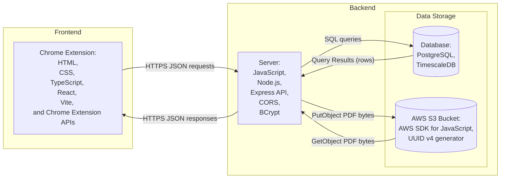

```mermaid

flowchart LR
  subgraph Frontend
    ext[Chrome Extension:<br/> HTML, <br/>CSS, <br/>TypeScript, <br/>React, <br/>Vite, <br/>and Chrome Extension APIs]
  end

  subgraph Backend
    api[Server:<br/> JavaScript,<br/> Node.js,<br/> Express API,<br/> CORS,<br/> BCrypt]

    subgraph Storage[Data Storage]
      db[(Database:<br/> PostgreSQL,<br/> TimescaleDB)]
      s3[(AWS S3 Bucket:<br/>AWS SDK for JavaScript,<br/> UUID v4 generator)]
    end
  end

  ext -->|"HTTPS JSON requests"| api
  api -->|"HTTPS JSON responses"| ext

  api -->|"SQL queries"| db
  db -->|"Query Results (rows)"| api

  api -->|"PutObject PDF bytes<br/>"| s3
  s3 -->|"GetObject PDF bytes"| api

```
