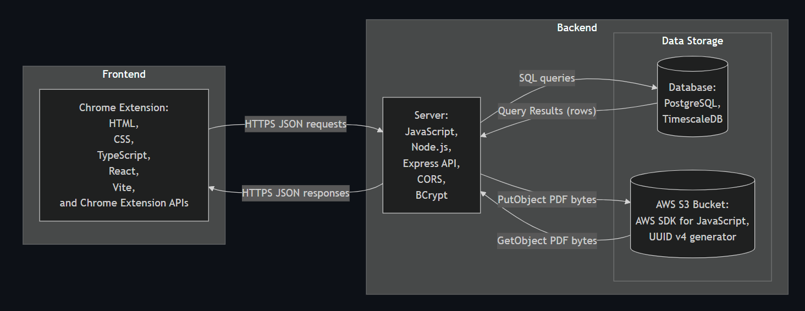
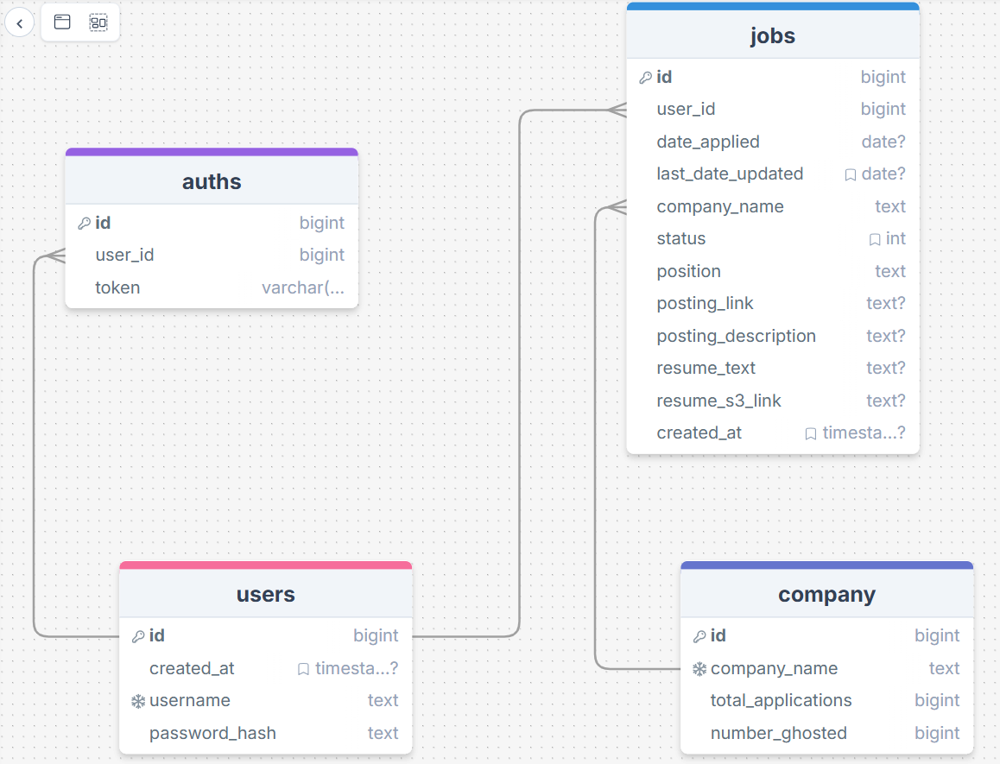

# Job Application Browser Extension - Final Report

---

## Summary of the project

Our project is a Chrome browser extension that allows users to organize and categorize job applications. To do that, this extension will store job application details and your associated resume, present a clean view of all your current applications, and let you modify the status of such applications as you progress in your job search. It will also show when a company is letting your application stall and present associated stats of certain companies.

---

## Diagrams and Demo Video

<!-- This video should be replaced by our in class recording -->

---

## Final Project QA

Q: What did you learn in this project?\
A: How is this different from question 7? TBD

Q: Does your project integrate with AI in any interesting way? If yes, please describe.\
A: Our project does not integrate with AI at this point. We have plans to incorporate AI into our chrome extension in the future however to quicken job application submissions to our database. It would help scrape job application details from the site a user is on and autopopulate the fields for user review. AI is a good fit because it can extropolate which fields (which change from website to website) should be copied for the title, description, etc. We have the user manually fill those inputs at the moment.

Q: How did you use AI to assist in building your project? Please, describe.\
A - Connor: I used LLMs to help me identify errors, provide context and ideas for next steps, and construct templates for tasks (mostly server endpoints) which I would then finish manually. I also used AI to provide a quick template server folder which our team built off over the course of the month.\
A - Kate: N/A\
A - Katie: N/A

---

## Final Project Contemplation Prompts

P: Discuss why this project is interesting to you!\
A: When you’re applying to lots of jobs, it’s hard to be motivated to keep a spreadsheet up-to-date with your applications, but our browser extension makes it easier because it is always in the top-right corner and only requires a few clicks (and optionally a little copy-pasting)

P: Key learnings from the project (please try to come up with at least 3)\
A - Connor: Looking back to the end of October has let me realize that I have gained many insights and skills from this final project. I learned how to concisely compare and distinguish between different database platforms after reading many long documentation pages, how to use mermaid diagraming tools, and the importance of avoiding refactoring pitfalls (refactoring our database tables after already populating them is not easy). I also gained exposure to the Postman graphical interface for sending requests and receiving responses which was new to me.\
A - Kate: N/A\
A - Katie: N/A

P: Explanation if applicable of failover strategy, scaling characteristics, performance characteristics, authentication, concurrency, etc.\
A: The future production version of our Chrome extension will require a more robust backend that uses a distributed Azure PostgreSQL database and multiple stateless servers behind a load balancer. This setup supports strong performance and concurrency by partitioning tables and queries across database nodes and splitting requests across multiple servers. It also delegates proper failover strategies for our database to Microsoft which redirects queries to healthy replicas. We would need to specify and implement a more specific failover strategy for our servers, presumably we would have our load balancer redirect traffic away from down servers so they can be brought back up.\
A: Our current authentication is handled by the backend API, which receives usernames and passwords over HTTPS, stores only salted and hashed passwords, and issues authtokens that the extension includes in the header on subsequent requests.
