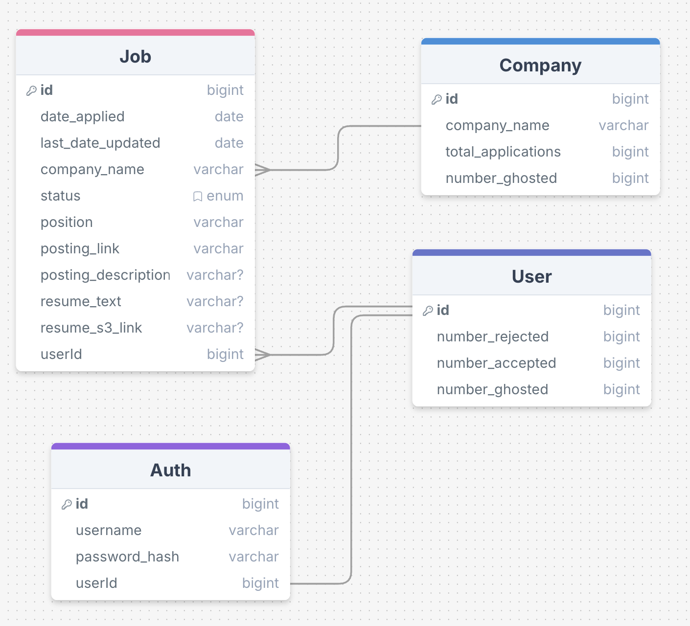

# Job Application Browser Extension - Initial Design

Our project is a Chrome browser extension that allows users to organize job applications. To do that, this extension will store job application details, store your associated resume and transcript, calculate the status of your application and present associated stats. Our goal is to deliver all of these features in one month.

**Sketch your initial thinking on your ERD and the data your project will be accessing and using**
Mostly text (scraped from the job posting or inputed by the user), date, bigint, enum. Also using S3 potentially as a way to store resume PDFs.

**Sketch rough system design of your project, what are the technologies and pieces (shapes) and interactions (arrows)**

### Initial Goals/Tasks for November 2025

| Monday    | Tuesday   | Wednesday | Thursday  | Friday    | Saturday  | Sunday    |
|----------:|----------:|----------:|----------:|----------:|----------:|----------:|
|           |           |           |           | **31** Brainstorm | **1** Initial Design | **2** Keep Sabbath Day Holy |
| **3** Get Feedback | **4** Initialize Browser Extension | **5** Job Application Scraping | **6** Job Application Scraping | **7** Meeting on Data Collection| **8** Test Data Collection  | **9** Keep Sabbath Day Holy |
| **10** Database Storage | **11** Database Storage | **12** Database Storage | **13** Database Storage | **14** Meeting on Database Design| **15** Test Database Functionality | **16** Keep Sabbath Day Holy |
| **17** Data Visualization | **18** Data Visualization | **19** Data Visualization | **20** Data Visualization | **21** Meeting on Visualization| **22** Test Proper Visualization | **23** Keep Sabbath Day Holy |
| **24** Additional Features | **25** Additional Features | **26** Integration Testing | **27** Integration Testing | **28** Presentation Meeting | **29** Final Testing | **30** Keep Sabbath Day Holy |
| **1** Class Presentation |  |  |  |  |  | **7** Keep Sabbath Day Holy |
